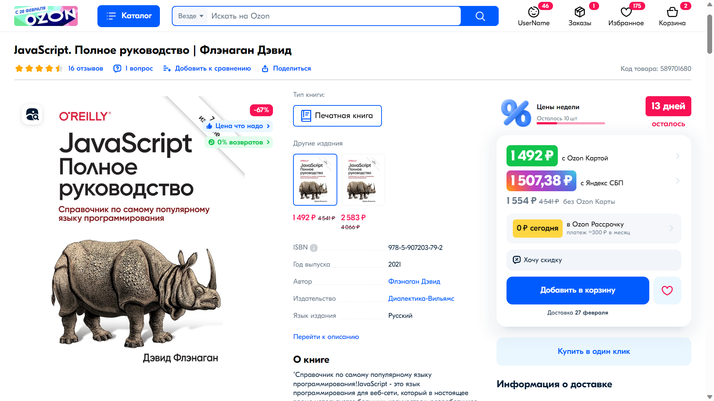
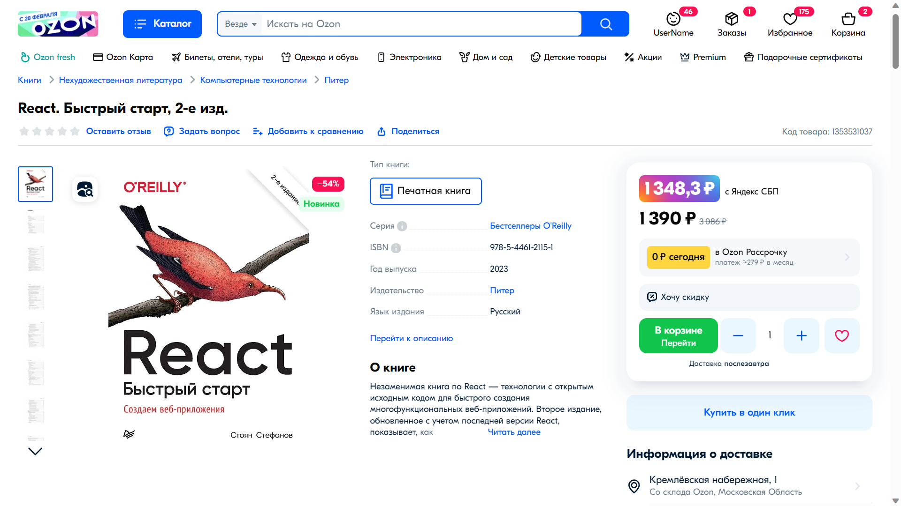
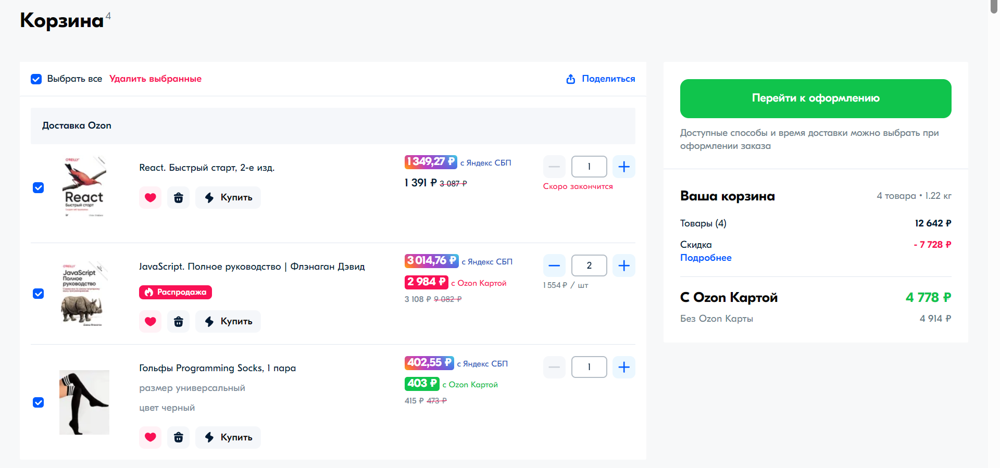

# Юзерскрипт для Ozon

[Установить через Greasy Fork](https://greasyfork.org/ru/scripts/488046)

Скрипт вставляет новый элемент с ценой с вычетом кэшбека от Яндекс Банка (при оплате через Я.Пэй или СБП).

Работает на странице товара и в корзине со всеми видами цен:

- cо скидкой от Ozon карты
- без скидки
- на распродаже

Протестирован в Tampermonkey для Chrome и Firefox.

❗Во время некоторых распродаж Ozon меняет верстку, так что скрипт может работать нестабильно.

## Инструкция

Для изменения кэшбэка (вычитаемой скидки) отредактируйте значение переменной `YANDEX_CASHBACK`.

Например, если ваш кэшбэк составляет 5%, установите `YANDEX_CASHBACK = 0.05`.

По умолчанию скидка 3%.

_____________

Опционально: для изменения цвета фона контейнера цены отредактируйте значение переменной `YANDEX_GRADIENT`.

Цвет должен быть задан **строкой** в формате RGB(A), HEX или в любом другом, поддерживаемом
в [CSS-свойстве background](https://developer.mozilla.org/en-US/docs/Web/CSS/background).

Например, если вы хотите использовать цвет фона #ff0000 (красный), установите `YANDEX_GRADIENT = '#ff0000'`;

По умолчанию фон в цветах Яндекса.

## Скриншоты

### На странице товара

### На странице корзины

